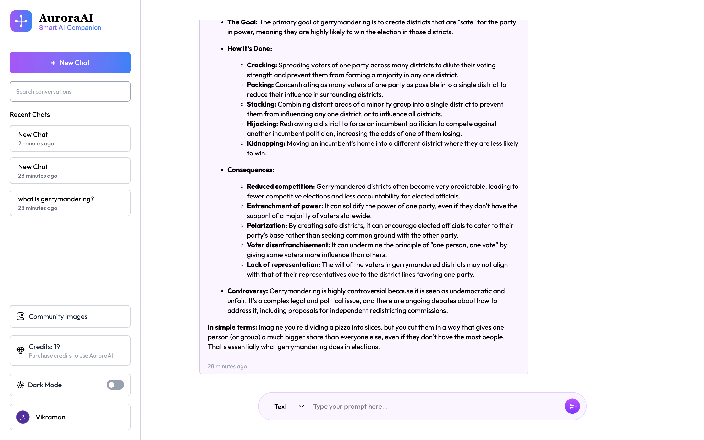
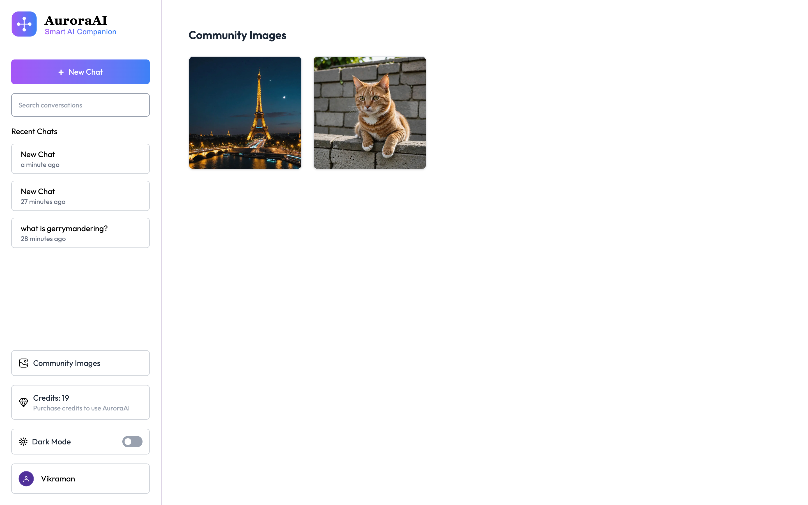
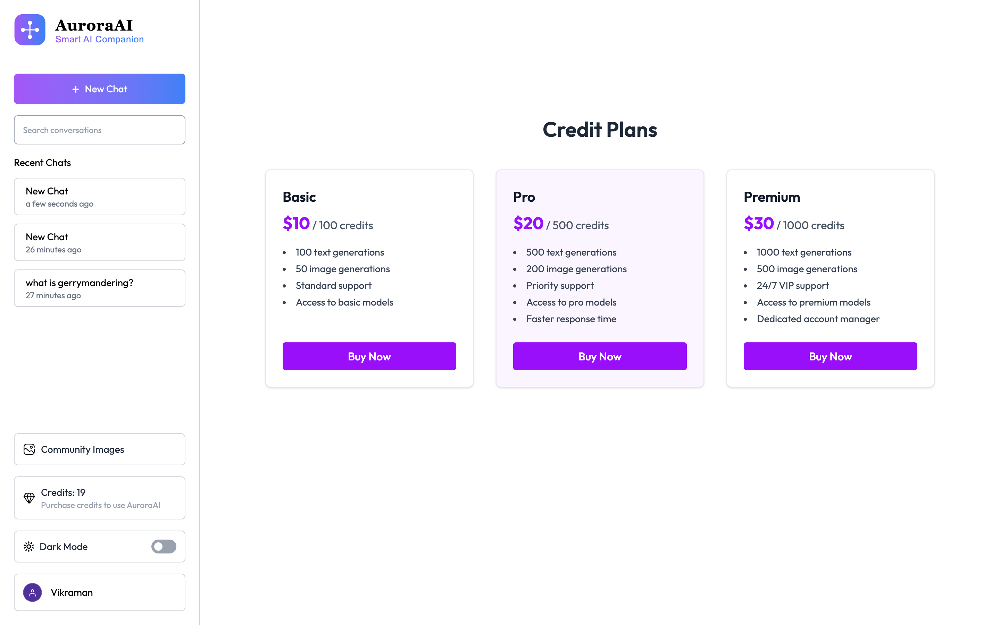

# 🤖 AuroraAI – AI Chat & Image Generation Platform

A production‑ready AI platform combining **conversational AI**, **image generation**, a **credit‑based system**, **Stripe payments**, and a **public community gallery**.
Built using **React + TypeScript + Vite**, **Node.js + Express**, **MongoDB**, **Gemini AI**, and **ImageKit**.

---

## 📸 Screenshots

All screenshots are stored in:

```
client/public/screenshots/
```

### 🏠 Dashboard


### 💬 Chat Interface



### 🧠 AI Response (Text)


### 🎨 AI Image Generation


### 🖼️ Community Page



### 💎 Credit Plans



---

# ✨ Features

## 🧠 AI Features

- **Gemini 2.0 Flash Text Generation**
- **AI Image Generation via ImageKit Transformations**
- **Supports text + image chat mode switching**
- **Publish generated images to community**
- **Markdown + syntax highlighting for code responses**

---

## 💳 Credit System & Stripe Payments

- 1 Credit → 1 Text Generation
- 2 Credits → 1 Image Generation
- Secure **Stripe Checkout** integration
- Plans: **Basic (100), Pro (500), Premium (1000)** credits
- **Webhook‑based credit application**
- Real‑time deduction after AI usage

---

## 👥 Community Features

- Public gallery for user‑generated images
- Automatic creator attribution
- High‑quality CDN‑hosted images using ImageKit
- Fully responsive masonry grid layout

---

## 💬 Chat Management

- Create unlimited chat sessions
- Auto‑naming based on first message
- Chat search + filter
- Delete chats with confirmation
- Auto-scroll to latest message
- Moment.js timestamps

---

## 🎨 UI / UX Features

- Dark & Light theme toggle
- Smooth animations
- Responsive layout with mobile sidebar
- Toast notifications
- Loading screens
- Code-friendly message formatting

---

# 🛠️ Tech Stack

## **Frontend**

- React 19 (Vite + TS)
- React Router 7
- TailwindCSS 4
- Axios (custom instance)
- React Markdown + Prism.js
- React Hot Toast

## **Backend**

- Express.js (TypeScript)
- MongoDB + Mongoose
- JWT Authentication
- Stripe Checkout
- ImageKit Upload API
- Gemini AI (via OpenAI SDK)
- Multer for uploads

---

# 🚀 Local Development Setup

## 1️⃣ Clone Repository

```bash
git clone https://github.com/yourusername/auroraai.git
cd auroraai
```

---

# ⚙️ Backend Setup

```bash
cd server
npm install
```

Create `.env`:

```env
PORT=8000
MONGODB_URI=
JWT_SECRET=

# Gemini AI
GEMINI_API_KEY=

# ImageKit
IMAGEKIT_PUBLIC_KEY=
IMAGEKIT_PRIVATE_KEY=
IMAGEKIT_URL_ENDPOINT=

# Stripe
STRIPE_SECRET_KEY=
STRIPE_WEBHOOK_SECRET=
```

Start backend:

```bash
npm run dev
```

---

# 💻 Frontend Setup

```bash
cd client
npm install
```

Create `.env`:

```env
VITE_BASE_URL=http://localhost:8000
```

Start frontend:

```bash
npm run dev
```

Frontend → http://localhost:5173
Backend → http://localhost:8000

---

# 🗂 Project Structure

```
auroraai/
├── client/
│   ├── public/
│   │   └── screenshots/
│   └── src/
│       ├── components/
│       ├── pages/
│       ├── context/
│       ├── api/
│       └── types/
└── server/
    ├── controllers/
    ├── routes/
    ├── middleware/
    ├── models/
    ├── configs/
    └── server.ts
```

---

# 🔗 API Endpoints

## User

| Method | Endpoint                     | Description        |
| ------ | ---------------------------- | ------------------ |
| POST   | `/api/user/register`         | Register new user  |
| POST   | `/api/user/login`            | Login user         |
| GET    | `/api/user/data`             | Fetch user profile |
| GET    | `/api/user/published-images` | Community gallery  |

---

## Chat

| Method | Endpoint           | Description   |
| ------ | ------------------ | ------------- |
| POST   | `/api/chat/create` | Create chat   |
| GET    | `/api/chat/list`   | Get all chats |
| POST   | `/api/chat/delete` | Delete chat   |

---

## AI

| Method | Endpoint             | Description       |
| ------ | -------------------- | ----------------- |
| POST   | `/api/message/text`  | Generate AI text  |
| POST   | `/api/message/image` | Generate AI image |

---

## Credits

| Method | Endpoint               | Description       |
| ------ | ---------------------- | ----------------- |
| GET    | `/api/credit/plan`     | List credit plans |
| POST   | `/api/credit/purchase` | Stripe checkout   |

---

# ⭐ Support

If this project helped you, please **star the repo** ⭐
