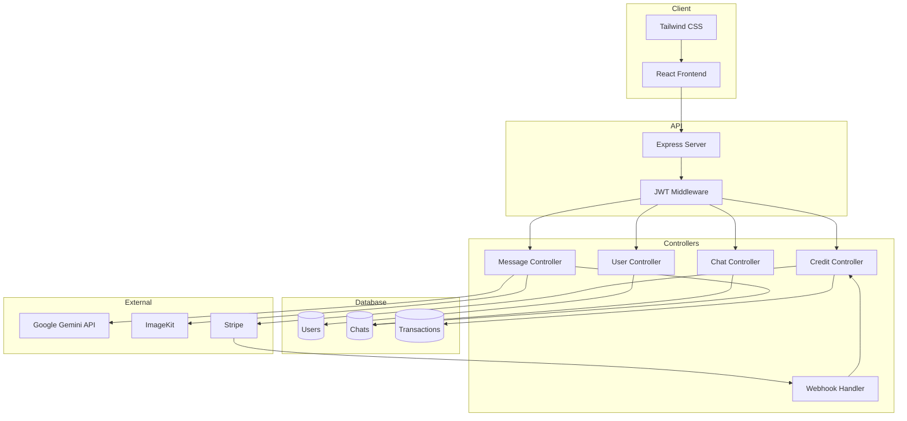
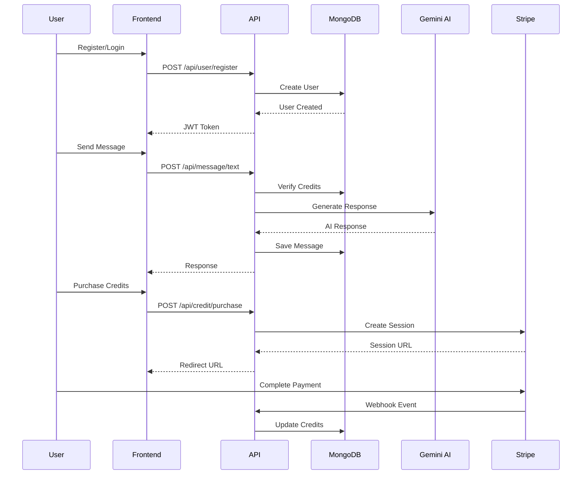
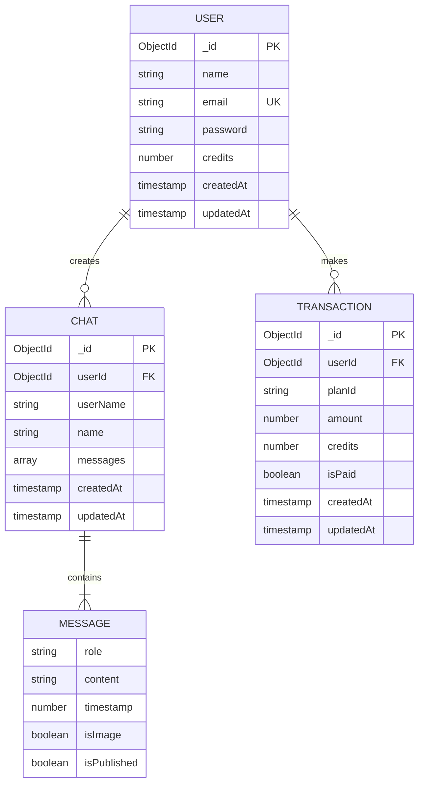
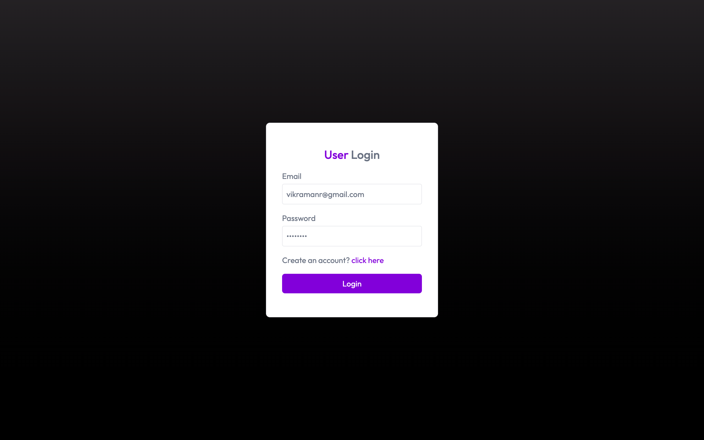

# AuroraAI - AI Chat & Image Generation Platform


A full-stack AI-powered platform for intelligent conversations and image generation.

[](https://aurora-ai-jet.vercel.app)
[](https://aurora-ai-server-eta.vercel.app)
[](https://www.typescriptlang.org/)
[](https://reactjs.org/)

[Live Demo](https://aurora-ai-jet.vercel.app) • [API Documentation](#api-endpoints) • [Report Bug](https://github.com/VIKRAMANR7/auroraai/issues)

---

## Overview

AuroraAI is a modern, full-stack AI platform that combines intelligent chat capabilities with AI-powered image generation. Built with the MERN stack and powered by Google's Gemini AI and ImageKit, it provides a seamless user experience with a credit-based monetization system.

**Frontend**: [https://aurora-ai-jet.vercel.app](https://aurora-ai-jet.vercel.app)

**Backend API**: [https://aurora-ai-server-eta.vercel.app](https://aurora-ai-server-eta.vercel.app)

---

## Features

### Core Functionality

- AI-Powered Chat using Google Gemini 2.0 Flash
- AI Image Generation via ImageKit
- Multi-Chat Management with create, manage, and switch capabilities
- Community Gallery for sharing AI-generated images

### Credit System

- Three-tier pricing plans (Basic, Pro, Premium)
- Stripe integration for secure payments
- Real-time credit tracking
- Automated credit allocation via webhooks

### User Experience

- Dark/Light mode with persistence
- Responsive design with Tailwind CSS
- Real-time message synchronization
- Search and filter conversations
- Markdown support with syntax highlighting

### Security

- JWT-based authentication
- bcrypt password hashing
- Protected API routes
- Environment variable validation

---

## Tech Stack

### Frontend

- React 19.1
- TypeScript 5.9
- Vite 7.1
- Tailwind CSS 4.1
- React Router 7.8
- Axios 1.11
- React Hot Toast
- React Markdown
- Prism.js
- Moment.js

### Backend

- Node.js with Express 5.1
- TypeScript 5.9
- MongoDB with Mongoose 8.0
- JWT Authentication
- Bcrypt.js
- Stripe 18.4
- OpenAI SDK 5.15 (Gemini API)
- ImageKit 6.0

### DevOps

- Vercel (Deployment)
- MongoDB Atlas (Database)
- ESLint + Prettier (Code Quality)

---

## Architecture

### System Architecture



### Data Flow



### Database Schema



---

## Getting Started

### Prerequisites

- Node.js >= 18.0.0
- pnpm >= 8.0.0
- MongoDB Atlas Account
- Stripe Account
- Google Gemini API Key
- ImageKit Account

### Installation

**Clone the repository**

```bash
git clone https://github.com/VIKRAMANR7/auroraai.git
cd auroraai
```

**Backend Setup**

```bash
cd server
pnpm install
cp .env.example .env
pnpm dev
```

**Frontend Setup**

```bash
cd client
pnpm install
cp .env.example .env
pnpm dev
```

**Access the Application**

- Frontend: http://localhost:5173
- Backend: http://localhost:5000

---

## Environment Variables

### Backend

```
PORT=5000
MONGODB_URI=your_mongodb_connection_string
JWT_SECRET=your_jwt_secret_key

STRIPE_SECRET_KEY=your_stripe_secret_key
STRIPE_WEBHOOK_SECRET=your_stripe_webhook_secret

GEMINI_API_KEY=your_gemini_api_key

IMAGEKIT_PUBLIC_KEY=your_imagekit_public_key
IMAGEKIT_PRIVATE_KEY=your_imagekit_private_key
IMAGEKIT_URL_ENDPOINT=https://ik.imagekit.io/your_id
```

### Frontend

```
VITE_BASE_URL=http://localhost:5000
```

---

## API Endpoints

### Authentication

| Method | Endpoint                     | Description          | Auth |
| ------ | ---------------------------- | -------------------- | ---- |
| POST   | `/api/user/register`         | Register new user    | No   |
| POST   | `/api/user/login`            | Login user           | No   |
| GET    | `/api/user/data`             | Get user profile     | Yes  |
| GET    | `/api/user/published-images` | Get community images | No   |

### Chat Management

| Method | Endpoint           | Description        | Auth |
| ------ | ------------------ | ------------------ | ---- |
| POST   | `/api/chat/create` | Create new chat    | Yes  |
| GET    | `/api/chat/list`   | Get all user chats | Yes  |
| POST   | `/api/chat/delete` | Delete chat        | Yes  |

### Messages

| Method | Endpoint             | Description       | Auth |
| ------ | -------------------- | ----------------- | ---- |
| POST   | `/api/message/text`  | Send text message | Yes  |
| POST   | `/api/message/image` | Generate image    | Yes  |

### Credits

| Method | Endpoint               | Description          | Auth |
| ------ | ---------------------- | -------------------- | ---- |
| GET    | `/api/credit/plan`     | Get available plans  | No   |
| POST   | `/api/credit/purchase` | Purchase credit plan | Yes  |

### Webhooks

| Method | Endpoint      | Description            | Auth      |
| ------ | ------------- | ---------------------- | --------- |
| POST   | `/api/stripe` | Stripe webhook handler | Signature |

---

## Screenshots

### Home Page


### Chat Interface


### Dark Mode


### Credit Plans


### Community Gallery


### Login Page



---

## Deployment

### Frontend (Vercel)

```bash
cd client
vercel --prod
```

### Backend (Vercel)

```bash
cd server
vercel --prod
```

Set environment variables in Vercel Dashboard for both deployments.

---

## Project Structure

```
auroraai/
├── client/
│   ├── src/
│   │   ├── api/
│   │   ├── assets/
│   │   ├── components/
│   │   ├── context/
│   │   ├── pages/
│   │   ├── types/
│   │   ├── utils/
│   │   ├── App.tsx
│   │   └── main.tsx
│   ├── public/
│   └── package.json
├── server/
│   ├── src/
│   │   ├── configs/
│   │   ├── controllers/
│   │   ├── middleware/
│   │   ├── models/
│   │   ├── routes/
│   │   ├── types/
│   │   ├── utils/
│   │   └── server.ts
│   └── package.json
└── README.md
```

---

## License

This project is licensed under the MIT License.

---

## Author

**Vikraman R**

GitHub: [@VIKRAMANR7](https://github.com/VIKRAMANR7)
