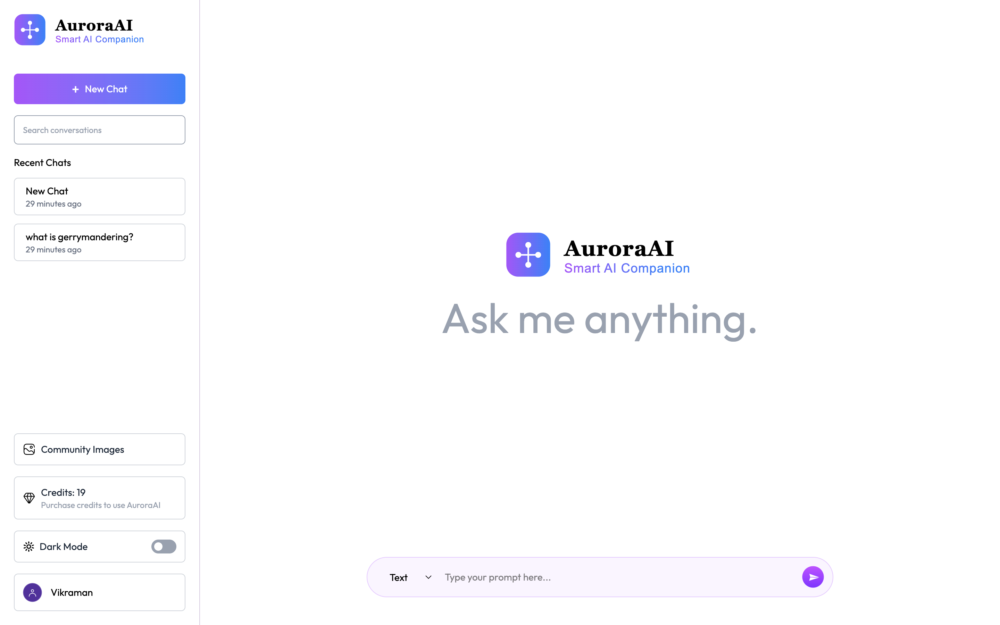
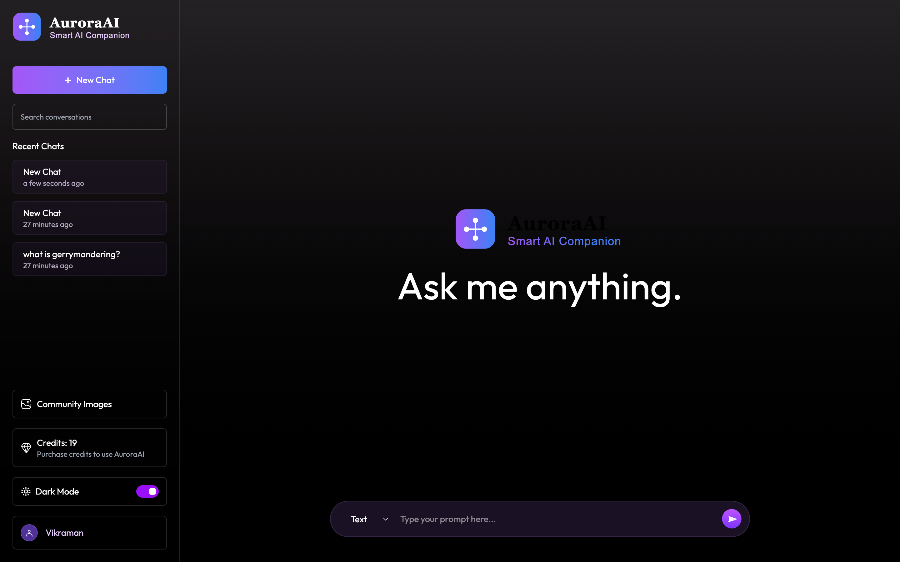
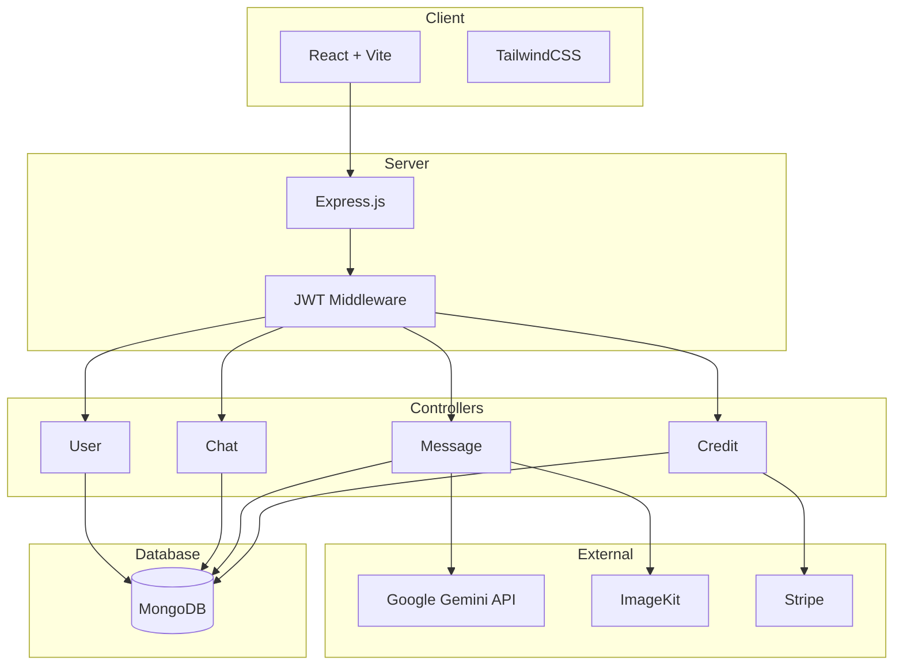
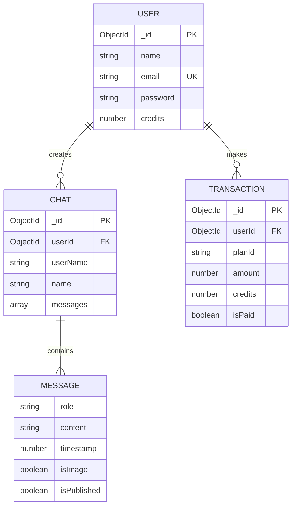

# AuroraAI

A full-stack AI-powered platform for intelligent conversations and image generation, built with the MERN stack, Google Gemini AI, and ImageKit.

## Live Demo

- Frontend: https://aurora-ai-jet.vercel.app
- Backend API: https://aurora-ai-server-eta.vercel.app

## Screenshots







## System Architecture



## Database Schema



## Features

### Core Features

- AI-powered chat using Google Gemini 2.0 Flash
- AI image generation via ImageKit
- Multi-chat management with create, switch, and delete
- Community gallery for sharing AI-generated images

### Credit System

- Three-tier pricing plans (Basic, Pro, Premium)
- Stripe integration for secure payments
- Real-time credit tracking
- Automated credit allocation via webhooks

### User Experience

- Dark/Light mode with persistence
- Responsive design
- Real-time message synchronization
- Markdown support with syntax highlighting

## Tech Stack

### Frontend

- React 19
- TypeScript
- Vite
- TailwindCSS
- React Router DOM
- Axios
- React Markdown
- Prism.js

### Backend

- Node.js
- TypeScript
- Express
- MongoDB with Mongoose
- JWT Authentication
- Bcrypt.js
- Stripe
- Google Gemini API
- ImageKit

## Project Structure

```
auroraai/
├── client/
│   └── src/
│       ├── api/
│       ├── assets/
│       ├── components/
│       ├── context/
│       ├── pages/
│       ├── types/
│       └── utils/
│
└── server/
    └── src/
        ├── configs/
        ├── controllers/
        ├── middleware/
        ├── models/
        ├── routes/
        ├── types/
        └── utils/
```

## API Endpoints

### Authentication

| Method | Endpoint                   | Description          |
| ------ | -------------------------- | -------------------- |
| POST   | /api/user/register         | Register new user    |
| POST   | /api/user/login            | Login user           |
| GET    | /api/user/data             | Get user profile     |
| GET    | /api/user/published-images | Get community images |

### Chat Management

| Method | Endpoint         | Description        |
| ------ | ---------------- | ------------------ |
| POST   | /api/chat/create | Create new chat    |
| GET    | /api/chat/list   | Get all user chats |
| POST   | /api/chat/delete | Delete chat        |

### Messages

| Method | Endpoint           | Description       |
| ------ | ------------------ | ----------------- |
| POST   | /api/message/text  | Send text message |
| POST   | /api/message/image | Generate image    |

### Credits

| Method | Endpoint             | Description          |
| ------ | -------------------- | -------------------- |
| GET    | /api/credit/plan     | Get available plans  |
| POST   | /api/credit/purchase | Purchase credit plan |

### Webhooks

| Method | Endpoint    | Description            |
| ------ | ----------- | ---------------------- |
| POST   | /api/stripe | Stripe webhook handler |

## Getting Started

### Prerequisites

- Node.js 20+
- pnpm
- MongoDB Atlas account
- Stripe account
- Google Gemini API key
- ImageKit account

### Installation

```bash
git clone https://github.com/VIKRAMANR7/auroraai.git
cd auroraai

cd server
pnpm install

cd ../client
pnpm install
```

### Environment Variables

Create `.env` files from `.env.example` in both client and server directories.

### Development

```bash
cd server
pnpm dev

cd client
pnpm dev
```

- Frontend: http://localhost:5173
- Backend: http://localhost:5000

## Author

Vikraman R - [@VIKRAMANR7](https://github.com/VIKRAMANR7)
